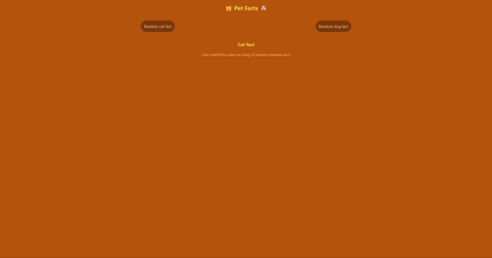
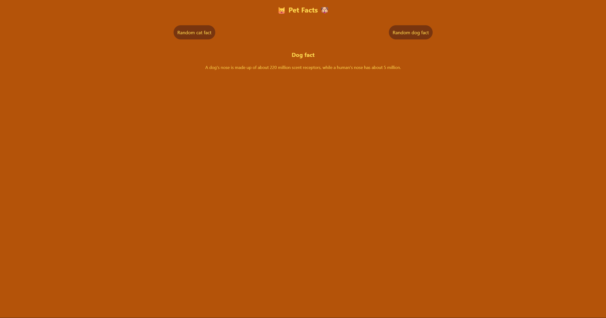

# Pet Facts

A small, focused React + TypeScript app that fetches random cat and dog facts from public APIs. It's a practice project showcasing modern frontend tooling (Vite + React + TypeScript), Tailwind styling, and pragmatic API handling with Axios.

## Table of Contents

- [Features](#features)
- [Tech Stack](#tech-stack)
- [Installation](#installation)
- [Scripts](#scripts)
- [API details](#api-details)
- [Screenshots](#screenshots)
- [License](#license)

## Features

- Fetch facts from public APIs (catfact.ninja, dogapi.dog)
- Cancel ongoing requests when a new request is triggered
- Loading, error, and success states with clear UI feedback
- Small, typesafe codebase using TypeScript and React hooks

## Tech Stack

- Vite
- React 19 + TypeScript
- Tailwind CSS
- Axios for HTTP requests

## Installation

1. Clone the repository

```powershell
git clone https://github.com/Sebastijan-Dominis/pet-facts.git
cd pet-facts
```

2. Install dependencies

```powershell
npm install
```

3. Start the server

```powershell
npm run dev
```

4. Open the server URL

- usually `http://localhost:5173`

## Scripts

- `npm run dev` — start dev server
- `npm run build` — compile TypeScript and build for production
- `npm run preview` — preview production build
- `npm run lint` — run ESLint

## API details

- Cat facts: `https://catfact.ninja/fact` — returns `{ fact: string, length: number }`
- Dog facts: `https://dogapi.dog/api/v2/facts` — returns an array under `data` with `attributes.body`

The app detects the response shape at runtime and maps it into a shared UI-friendly shape.

## Screenshots





## License

See the `LICENSE` file in the repository.

**Contributing**
- This is a small practice project but contributions are welcome. Open an issue or submit a pull request with a clear description of the change.

**Contact / Author**
- Author: repository owner (see repository metadata).
